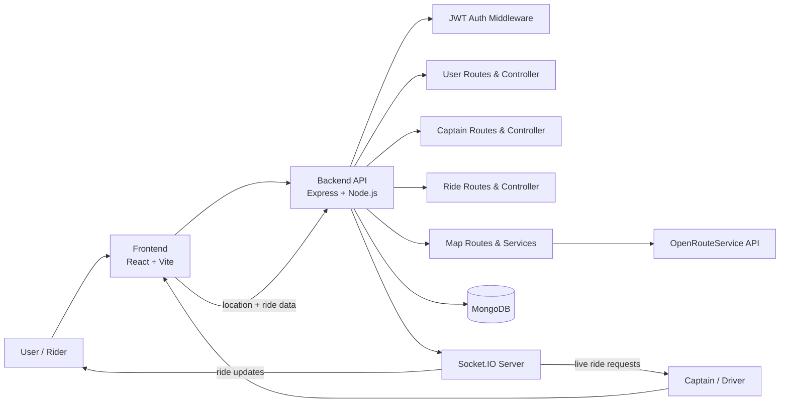
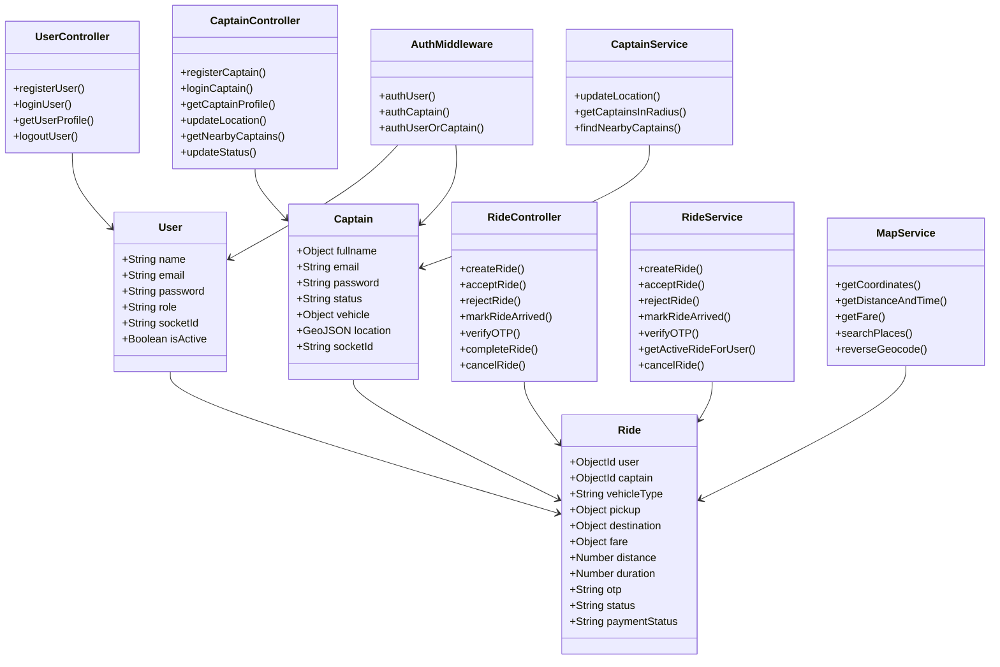

# BookRide

BookRide is a full-stack ride-hailing clone inspired by Uber. It includes rider and captain flows, live ride matching via Socket.IO, location-based captain discovery, OTP verification, and map route calculations.

## Overview

This project is divided into two main applications:

- Frontend: React + Vite app for users and captains
- Backend: Node.js + Express app with MongoDB and Socket.IO

The system supports:
- User registration and login,
- Captain registration and login
- Captain online/offline status management
- User ride requests with pickup and destination
- Nearby captain discovery using geospatial queries
- Real-time ride request broadcasting over WebSockets
- Ride accept/reject/arrive/OTP verification/complete flow
- Route distance, duration, and fare estimation via map services

---

## Tech Stack

### Frontend
- React 19
- Vite
- React Router
- Axios
- Socket.IO Client
- MapLibre / Mapbox-like map integration
- GSAP for animation
- Tailwind CSS

### Backend
- Node.js
- Express 5
- MongoDB + Mongoose
- Socket.IO
- JWT Authentication
- bcrypt for password hashing
- dotenv for environment config

### External Services
- OpenRouteService / geocoding and routing APIs
- MongoDB geospatial indexing for nearby captain search

---

## Architecture Diagram



## UML Diagram



## Project Architecture

The project is structured as a classic full-stack MVC-like setup with service and route layers.

```text
uber-clone/
├── Backend/
│   ├── app.js
│   ├── db.js
│   ├── server.js
│   ├── controllers/
│   │   ├── captain.controller.js
│   │   ├── maps.controller.js
│   │   ├── ride.controller.js
│   │   └── user.controller.js
│   ├── middlewares/
│   │   └── auth.middleware.js
│   ├── models/
│   │   ├── captain.model.js
│   │   ├── ride.model.js
│   │   └── user.model.js
│   ├── routes/
│   │   ├── captain.routes.js
│   │   ├── map.routes.js
│   │   ├── ride.routes.js
│   │   └── user.routes.js
│   ├── services/
│   │   ├── captain.services.js
│   │   ├── fare.service.js
│   │   ├── maps.service.js
│   │   ├── ride.service.js
│   │   └── user.services.js
│   ├── utils/
│   │   ├── cors.js
│   │   ├── generateToken.js
│   │   └── socket.js
│   └── package.json
├── frontend/
│   ├── index.html
│   ├── package.json
│   ├── vite.config.js
│   ├── public/
│   └── src/
│       ├── App.jsx
│       ├── config.js
│       ├── components/
│       ├── constants/
│       ├── context/
│       ├── pages/
│       ├── services/
│       ├── App.css
│       ├── index.css
│       └── main.jsx
├── package.json
├── README.md
└── _log_backup/
```

### Backend Layers

- Routes: define API endpoints
- Controllers: handle HTTP logic and request validation
- Services: contain business logic and database operations
- Models: Mongoose schemas for User, Captain, and Ride
- Middleware: JWT authentication for riders and captains
- Utils: token generation, CORS config, and Socket config

### Frontend Layers

- Pages: screens like login, signup, home, captain dashboard
- Components: search panels, map display, vehicle selection, ride UI
- Context: user and captain state management
- Services: Axios clients and Socket.IO connections
- Constants: local storage key configuration

---

## Request and Data Flow

### 1) User flow

1. User opens frontend and signs up or logs in.
2. The frontend sends credentials to the backend API.
3. Backend validates input and creates a JWT token.
4. The user is redirected to the home page.
5. User enters pickup, destination, and vehicle type.
6. The frontend calls the map API to estimate distance, duration, and fare.
7. The user creates a ride request.
8. Backend stores the ride in MongoDB with status `requested`.
9. Nearby active captains are searched using MongoDB geospatial queries.
10. Matching captains receive a real-time ride request through Socket.IO.

### 2) Captain flow

1. Captain logs in and sets their status to active.
2. Captain location is sent to the backend using browser geolocation.
3. The captain is stored in MongoDB with a 2dsphere location index.
4. The backend keeps the captain socket connection in memory.
5. When a ride is created, nearby active captains receive a live request.
6. Captain can accept or reject the ride.
7. If accepted, the ride status changes to `accepted`.
8. When the captain arrives, the ride status moves to `arrived`.
9. User and captain verify OTP.
10. Ride moves to `ongoing` and later `completed`.

### 3) Real-time matching flow

The backend creates a Socket.IO server in `server.js` and attaches `io` to the Express app.

- Captains join a room-like socket registration using `join-captain`.
- User requests are broadcast to nearby captains.
- Captains receive ride notifications in real time.
- Acceptance/rejection events update the ride status in MongoDB.
- The frontend listens for `new-ride-request`, `ride-accepted`, `ride-updated`, and related events.

---

## Key Database Models

### User Model
Represents rider accounts.

- `name`
- `email`
- `password`
- `role`
- `socketId`
- `isActive`

### Captain Model
Represents driver accounts.

- `fullname.firstname`
- `fullname.lastname`
- `email`
- `password`
- `status` (`active` / `inactive`)
- `vehicle` info
- `location` as GeoJSON point
- `socketId`

### Ride Model
Represents a single trip lifecycle.

- `user`
- `captain`
- `rejectedBy`
- `vehicleType`
- `pickup`
- `destination`
- `fare`
- `distance`
- `duration`
- `otp`
- `status`
- `paymentStatus`

Important note: the ride schema uses geospatial indexes for pickup and destination coordinates, which allows efficient nearby-captain or route-based queries.

---

## Authentication and Authorization

JWT is used for secure API access.

- `authUser` protects rider-only endpoints
- `authCaptain` protects captain-only endpoints
- `authUserOrCaptain` allows endpoints shared by both roles

The backend reads the token from:

- Cookie (`token`), or
- Authorization header (`Bearer <token>`)

---

## Map and Fare Logic

The backend includes map services that call the OpenRouteService API for:

- address lookup / geocoding
- reverse geocoding
- route distance and duration
- fare estimation

The route data is used to calculate:

- ride distance in km
- travel duration in minutes
- estimated fare based on distance/time and vehicle type

---

## Environment Variables

Create a `.env` file in the `Backend` folder.

```env
PORT=3000
MONGO_URI=mongodb://localhost:27017/bookride
JWT_SECRET=your_secret_key
ORS_API_KEY=your_openrouteservice_key
```

You may also need to configure CORS origins depending on your frontend URL.

---

## Run the Project Locally

### 1) Install backend dependencies

```bash
cd Backend
npm install
```

### 2) Install frontend dependencies

```bash
cd frontend
npm install
```

### 3) Start the backend server

```bash
cd Backend
npm run dev
```

### 4) Start the frontend

```bash
cd frontend
npm run dev
```

The backend usually runs on a local port such as `3000`, while the frontend runs via Vite on a local development port such as `5173`.

---

## Typical Usage Workflow

### Rider perspective

1. Register or login
2. Search pickup and destination
3. Select a vehicle type
4. Ride is created and sent to nearby captains
5. Await captain acceptance
6. Board the ride and verify OTP when captain arrives
7. Complete the trip

### Captain perspective

1. Register or login
2. Enable online status
3. Share live GPS location
4. Receive nearby ride requests in real time
5. Accept or reject requests
6. Drive to the pickup point
7. Verify rider OTP and complete the journey

---

## Notes and Design Considerations

- MongoDB geospatial querying is used for nearby captain matching.
- Socket.IO is used for low-latency, real-time ride dispatching.
- The app is designed as a learning project and follows a service/route-separated architecture.
- Frontend state is partially persisted in localStorage so the ride flow can remain available after refresh.

---

## Summary

BookRide is a simplified Uber-style application built to demonstrate the full lifecycle of a ride-hailing platform:

- authentication
- trip creation
- live matching
- real-time communication
- geolocation
- route calculation
- fare estimation
- OTP verification
- ride completion

This project is a strong example of a real-time full-stack web application combining frontend UX, backend APIs, database modeling, and WebSocket-driven interactions.

